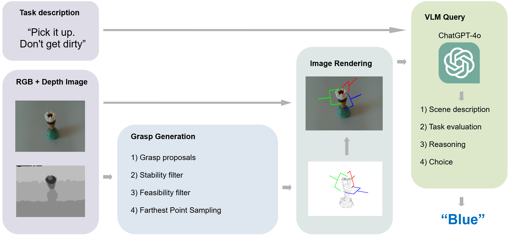

# VLM Grasper

VLM Grasper is a ROS pipeline to find zero-shot semantic grasp positions using Chat-GPT4o.



More information can be found in this [PDF](paper.pdf)

## Setting Up the Environment

### 1. **Clone the Repository**

Start by cloning the VLM Grasper repository:

```bash
git clone https://github.com/lfranceschetti/VLM_grasper.git
cd VLM_grasper
```

### 2. **Initialize and Update ROS Workspace**

Install wstool if it's not already available:

```bash
sudo apt-get update
sudo apt install python3-wstool
```

Then initialize and update the ROS workspace using .rosinstall:

```bash
wstool update -t src
cd src
```

### 3. **Install the Franka_ros Package**

Install the franka_ros package from the RSL Bitbucket:

### 4. **Install ROS Dependencies**

```bash
cd ..
rosdep install --from-paths src --ignore-src -r -y
```

### 5. **Build the Workspace**

```bash
catkin_make
source devel/setup.bash
```

### 5. **Setup a New Conda Environment**

Setup a new conda environment:

```bash
conda create --name vlm_grasper python==3.10
conda activate vlm_grasper

```

The following command sets up the required packages automatically.
So far the pipeline has only been tested with CUDA 12.1. If other versions are used the torch installations have to be adjusted.

```bash
./setup_conda_env.sh
```

### 6. **Install ROS Noetic**

Install ROS Noetic:

```bash
conda install -c conda-forge ros-noetic-desktop-full yaml -y
source /opt/ros/noetic/setup.bash
```

## Running the Pipeline

### 1. **Add OpenAI Key**

Add your OpenAI API key:

```bash
export OPENAI_API_KEY="Your OpenAI-Key"
```

### 2. **Setup the Simulation Environment**

In one terminal, setup the simulation environment:

```bash
source devel/setup.bash
roslaunch vlm_grasper init.launch
```

### 3. **Run the Pipeline**

In another terminal, run the pipeline. The scene needs to be defined in the `config/experiments.yaml` file and have a bagfile and a config in the `experiments/[scene_name]` folder (standard example is the sponge_juice scene):

```bash
roslaunch vlm_grasper pipeline_bag.launch
```

## Finding Experimental Results and Reproduce

The .bag files used in the experiments as well as the resulting images and VLM answers of the runs can be found in
https://drive.google.com/drive/folders/1fkG8Di-FXzjpdp9EPEluZ9tlr654D6__?usp=drive_link

### Capturing a New Scene

When using an Intel Realsense Camera Lidar 515, a new scene can be captured with:

```bash
roslaunch realsense2_camera rs_camera.launch filters:=pointcloud align_depth:=true depth_width:=640 depth_height:=480 depth_fps:=30 color_width:=640 color_height:=480 color_fps:=30
```
